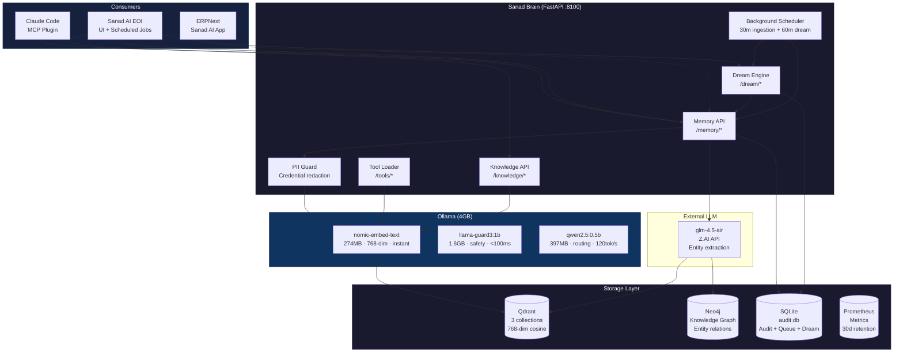
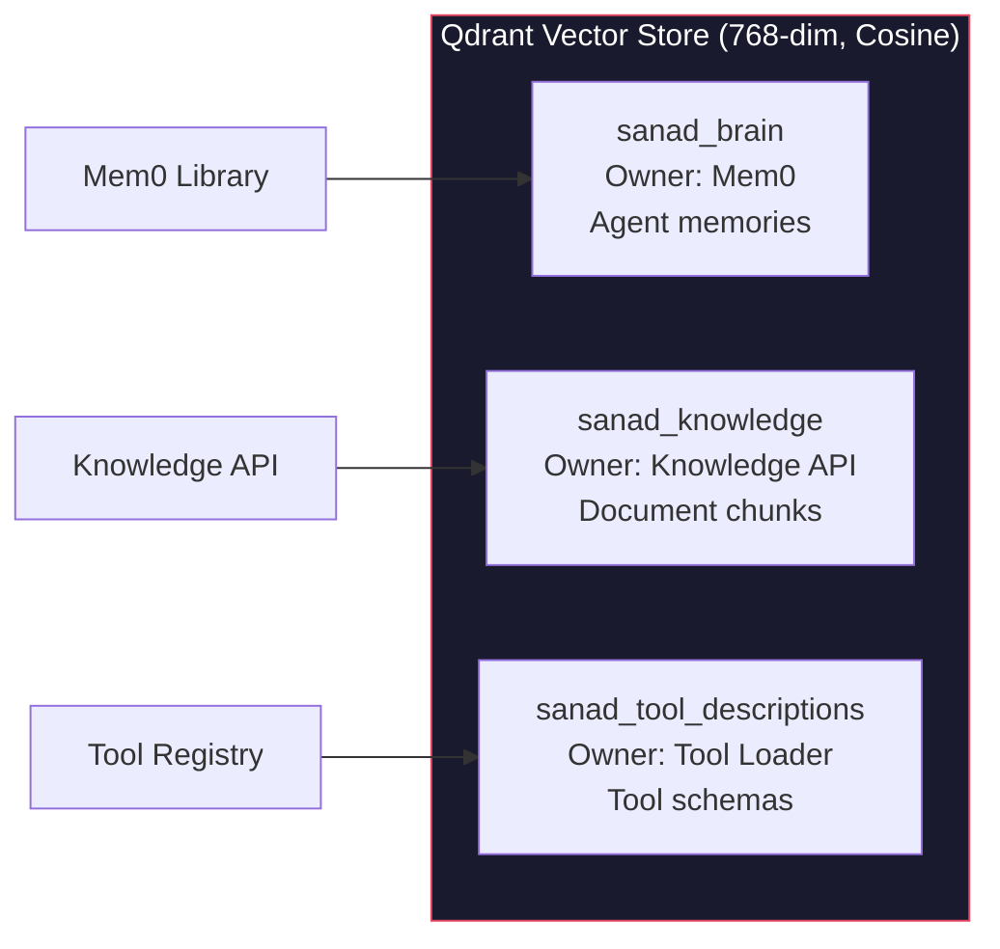
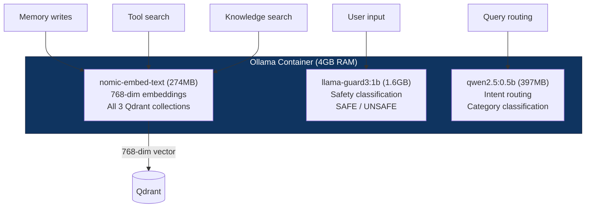
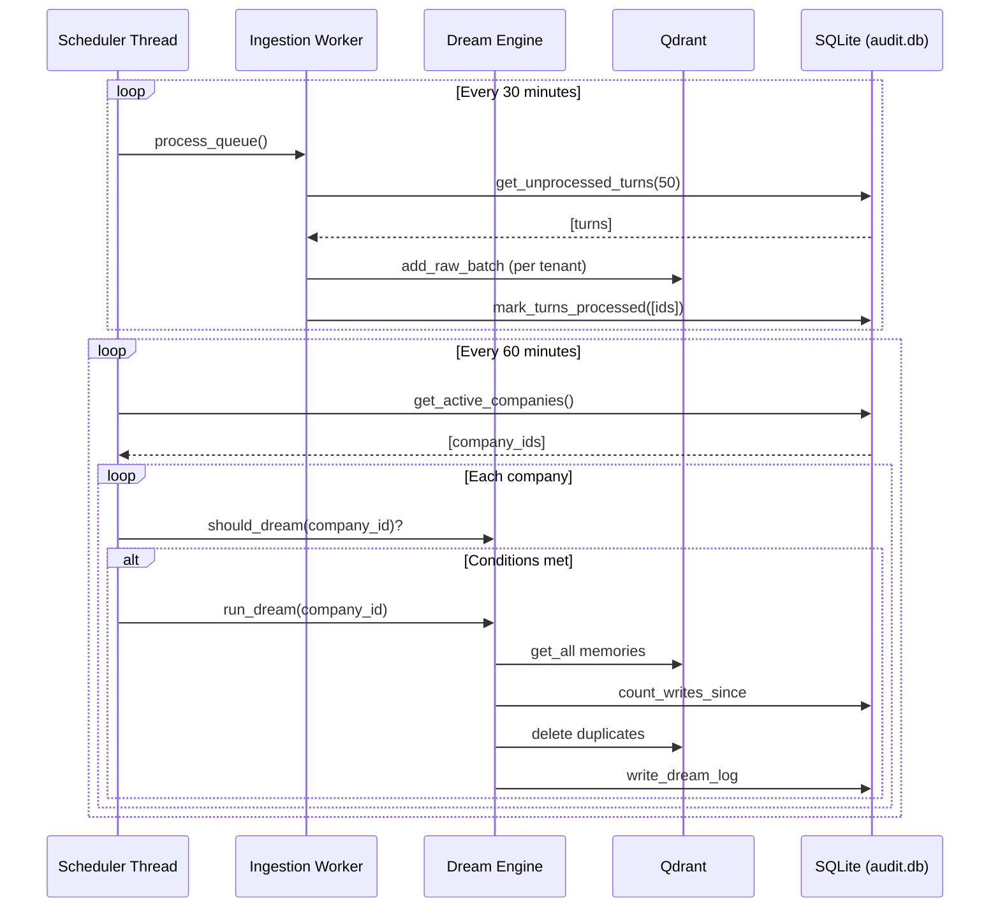

# Sanad Brain Architecture Guide

## System Overview

Sanad Brain is the persistent memory, knowledge, and tool management layer for the Sanad AI agent platform. It runs as a standalone Docker stack (6 containers) on a 64GB Hetzner VPS.

## Architecture Diagram



## Qdrant Collections



**Rules:**
- `sanad_brain` is managed by Mem0 — never write directly
- `sanad_knowledge` is managed by the Knowledge API
- `sanad_tool_descriptions` is managed by the Tool Registry
- All use the same nomic-embed-text embedder (768-dim)

## Data Flow Paths

### Path 1: Real-Time Memory (2-5s)
```
Agent → POST /memory/remember
  → PII Guard (redact credentials)
  → Mem0 (glm-4.5-air extracts entities)
    → Qdrant upsert (sanad_brain)
    → Neo4j graph (entity relations)
  → Audit log
```

### Path 2: Batch Memory (~200ms per batch)
```
Agent → POST /memory/queue
  → SQLite turn_queue (dedup by hash)
  → [Every 30 min] Scheduler
    → nomic-embed-text (batch embed)
    → Qdrant upsert (sanad_brain, raw)
    → Mark processed
```

### Path 3: Tool Search (~25ms)
```
Agent → POST /tools/search
  → nomic-embed-text (embed query)
  → Qdrant cosine search (sanad_tool_descriptions)
  → Top 5-10 tools returned with schemas
```

### Path 4: Knowledge RAG (~100ms)
```
Agent → POST /knowledge/search
  → nomic-embed-text (embed query)
  → Qdrant cosine search (sanad_knowledge)
  → Top chunks returned with scores
```

### Path 5: Dream Consolidation (daily)
```
Scheduler (hourly check) → should_dream()?
  → Phase 1: Orient (count memories)
  → Phase 2: Gather (audit log delta)
  → Phase 3: Consolidate (dedup + date normalization)
  → Phase 4: Prune (enforce 200 memory limit)
  → Dream log written
```

## Ollama Model Architecture



**Key facts:**
- Models lazy-load on first call, unload after idle
- Total RAM: ~2.3GB active, 4GB limit
- All embedding goes through nomic-embed-text (single model, consistent vectors)
- llama-guard3 and qwen2.5 are for future guardrail/routing integration

## Background Scheduler



## Resource Budget

| Container | RAM Limit | Actual | Purpose |
|-----------|-----------|--------|---------|
| sanad-brain | 4GB | ~1GB | FastAPI + Mem0 + Scheduler |
| sanad-ollama | 4GB | ~2.3GB | 3 models (lazy-loaded) |
| sanad-qdrant | 4GB | ~500MB | 3 collections, ~360 vectors |
| sanad-neo4j | 10GB | ~2GB | Knowledge graph |
| sanad-litellm | 1GB | ~200MB | Model proxy |
| sanad-prometheus | 1GB | ~100MB | Metrics (30d retention) |
| **Total** | **24GB** | **~6GB** | **18GB headroom on 64GB server** |

## Security

- All endpoints require `X-Api-Key` header
- PII Guard auto-redacts: emails, phone numbers, IPs, API keys, passwords, bearer tokens, Figma/Outline tokens
- Memories isolated by `company_id::user_id` in Qdrant payloads
- Sensitivity ceiling: role-based read access (viewer → admin)
- Prompt injection detection blocks malicious memory storage
- Neo4j graph errors don't block vector writes (monkey-patched)
