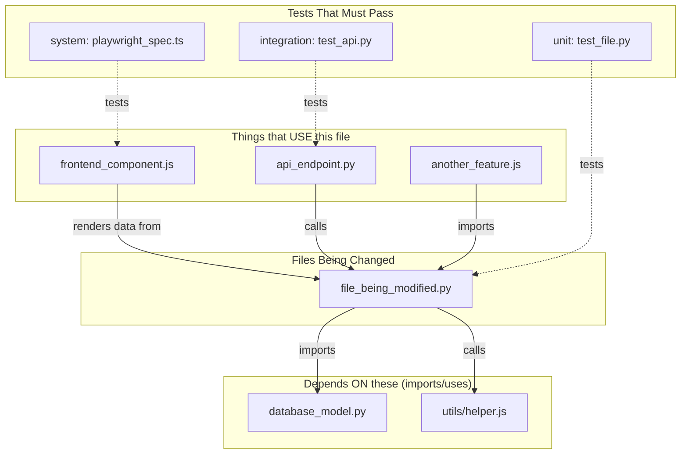
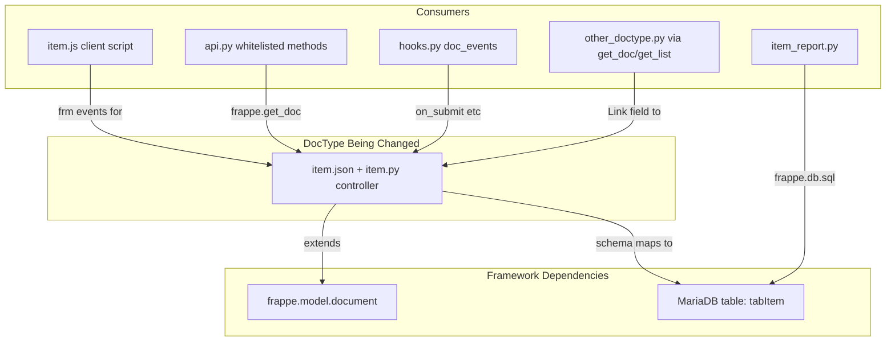
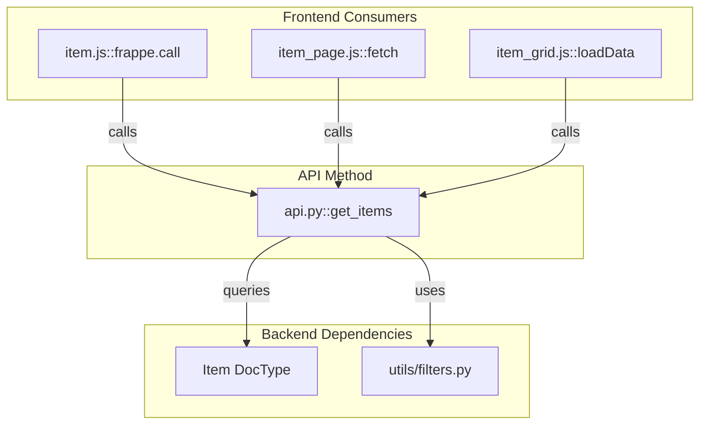
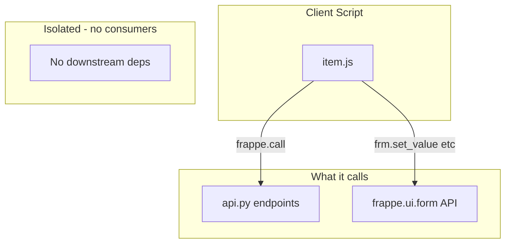

# Dependency Diagram Reference

## Purpose

The dependency diagram is the FIRST artifact produced in TIL. It maps the blast radius of a change
so you know exactly what files are affected, why, and in what order to modify them.

## Mermaid Template

## Annotation Rules

- **Solid arrows** `-->` = runtime dependency (imports, calls, queries)
- **Dashed arrows** `-.->` = test coverage
- **Label each arrow** with WHY: `calls`, `imports`, `renders`, `queries`, `triggers hook`
- **Color-code blast radius**:
  - Red subgraph = high blast radius (many consumers, breaking change)
  - Yellow subgraph = medium (few consumers, non-breaking but needs update)
  - Green subgraph = isolated (no downstream consumers)

## Frappe/ERPNext Specific Patterns

### DocType Change

### Whitelisted API Change

### Client Script Change

## Change Order Table Template

After the diagram, always produce this table:

| # | File | Why it changes | After which change | Blast |
|---|------|---------------|-------------------|-------|
| 1 | `models/item.py` | Data contract changes | — (start here) | High |
| 2 | `api/item_api.py` | Uses model, must update | After #1 | Medium |
| 3 | `frontend/item.js` | Calls API, UI update | After #2 | Low |

**Blast** column values:
- **High** — Breaking change, many consumers, requires careful coordination
- **Medium** — Non-breaking but needs update, few consumers
- **Low** — Isolated change, no downstream impact

## Rules

1. Always trace BOTH directions: what does this file depend on AND what depends on it
2. Include transitive dependencies (A → B → C means changing A may affect C)
3. For Frappe apps, always check: hooks.py, client scripts, whitelisted APIs, reports, and Link fields
4. The change order table dictates implementation sequence — never skip ahead
